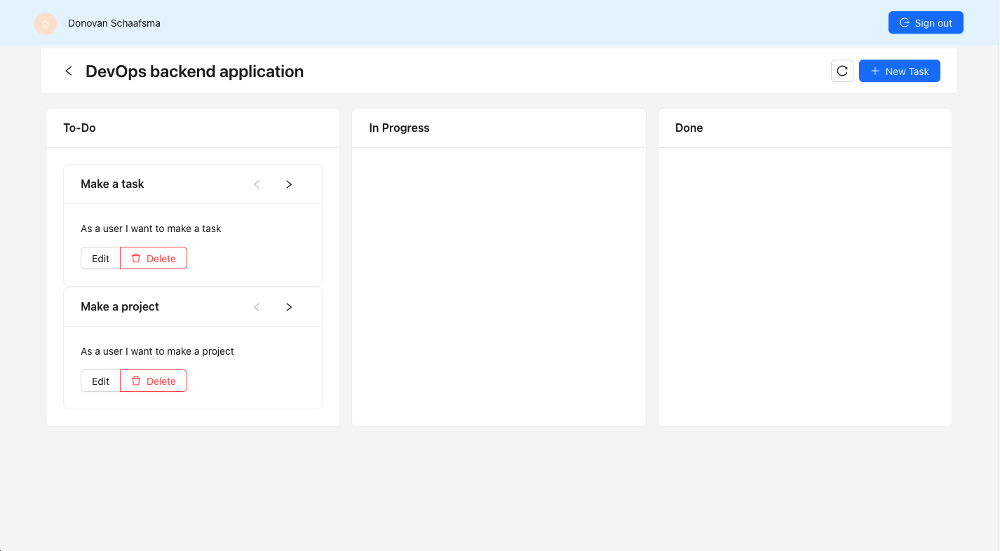

## Project Name & Pitch
SprintVision

An application used to create scrum boards for development teams to integrate into their agile workflow. Built with React, TypeScript, and a combination of AWS services.

## Project Status

This project is currently in development. It is possible to create, update, and delete projects. Within these projects you can create, update, and delete tasks. There also exist three columns, namely: 'To-Do', 'In Progress', and 'Done'. 
Users pick tasks and update their status accordingly to one of the three states. New tasks are always created in the 'To-Do' state.

## Installation and Setup Instructions

Clone down this repository. You will need `node` and `npm` installed globally on your machine.

Installation:

`npm install`

To Run Test Suite:

`npm test`

To Start Server:

`npm start`

To Visit App:

`localhost:3000/`

Or go to the following URL to see the current live version:

`https://main.d3dnw7a43fmsto.amplifyapp.com/`

## Project Screen Shots

